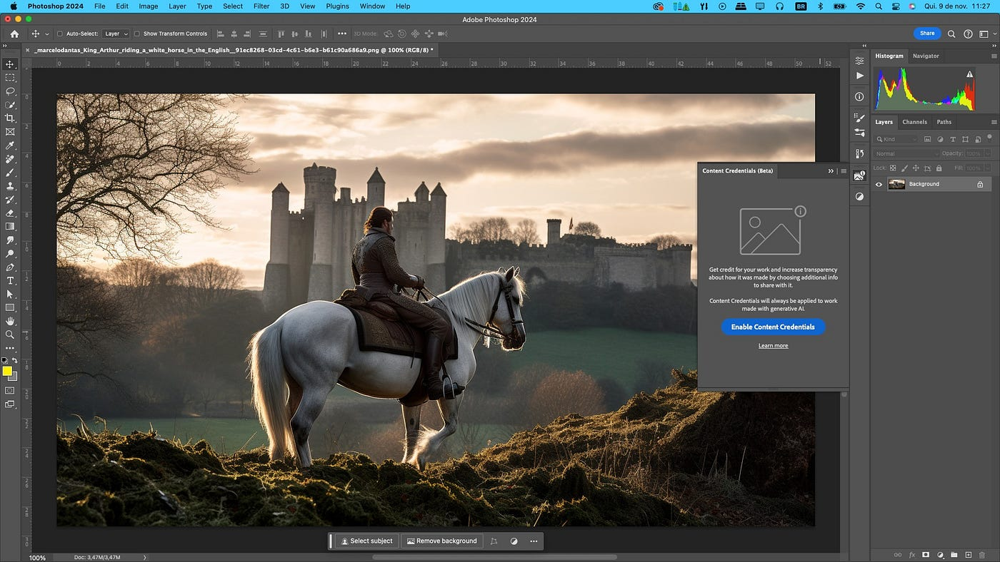
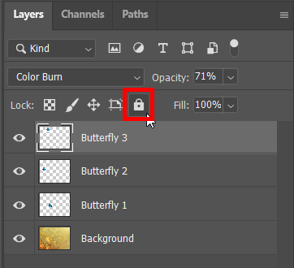
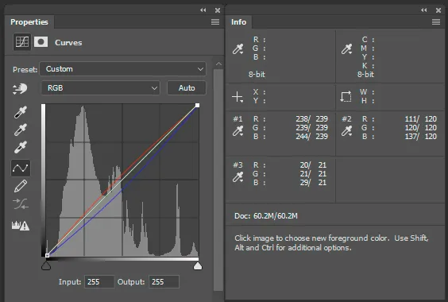

# Adobe Photoshop
## Ime i prezime: Ivan Radić  
### Studijski program: Stručni prijediplomski studij Informacijske tehnologije  
### Predmet: Akademsko i tehničko pisanje  
### Datum izrade: 14. studenoga 2024.

---

<small>Izvor:https://miro.medium.com/v2/resize:fit:1400/0*DNq-ARrr1EJKpnJe.jpg</small>

---

## Uvod
### Što je Adobe Photoshop i čemu služi?
- Adobe Photoshop je profesionalni alat za obradu digitalnih slika, razvijen od strane Adobe Inc.
- Služi za uređivanje fotografija, stvaranje grafičkih dizajna, ilustracija i digitalnih umjetničkih djela.
---

### Zašto je Photoshop važan za IT stručnjake?
- **Primjena u IT-u**:
  - Kreiranje vizualnog sadržaja za korisnička sučelja (UI/UX).
  - Priprema grafika za web razvoj i digitalni marketing.
- **Prednosti**:
  - Omogućuje visoku razinu prilagodbe i fleksibilnosti u radu s vizualnim elementima.
  
---

## Glavne značajke
### Ključne funkcionalnosti:
1. **Višeslojno uređivanje**:
   - Rad s "layers" za slojevitu manipulaciju slika.

---
## Glavne značajke
### Ključne funkcionalnosti:
2. **Alati za selekciju i retuširanje**:
   - "Lasso Tool", "Magic Wand" itd.

---
## Glavne značajke
### Ključne funkcionalnosti:
3. **Napredna korekcija boja**:
   - Usklađivanje tonova, kontrasta i svjetline.

---
## Glavne značajke
### Ključne funkcionalnosti:
4. **Filtar efekti**:
   - Dodavanje specijalnih efekata za poboljšanje vizualne kvalitete.

---

### Praktični primjeri korištenja:
- **Fotografija**:
  - Uklanjanje pozadine, retuširanje portreta.
- **Dizajn**:
  - Izrada postera, banera i logotipa.
- **Digitalna umjetnost**:
  - Slikanje ilustracija pomoću prilagođenih četkica.

---

## Upute za početak
### Instalacija alata:
1. Posjetite službenu stranicu Adobe Photoshopa: [Adobe Photoshop](https://www.adobe.com/products/photoshop.html).
2. Preuzmite i instalirajte Creative Cloud aplikaciju.
3. Prijavite se i preuzmite Photoshop.

### Kako započeti rad:
1. Pokrenite aplikaciju i otvorite novu datoteku (`File > New`).
2. Koristite osnovne alate poput "Move Tool", "Brush Tool", i "Eraser Tool".
3. Za početnike: Preporučuje se pregled tutorijala na [Adobe Learn](https://helpx.adobe.com/photoshop/tutorials.html).

---

## Prednosti i nedostaci
### Glavne prednosti:
- Intuitivno korisničko sučelje.
- Bogatstvo alata za kreativne zadatke.
- Povezivost s drugim Adobe aplikacijama.

---

### Nedostaci:
- Visoka cijena pretplate.
- Složenost za početnike.
- Velika potrošnja resursa računala.

---

#### Kako prevladati nedostatke:
- Korištenje besplatnih tutorijala i online resursa.
- Isprobavanje alternativnih alata za manje zahtjevne projekte (npr. GIMP).

---

## Zaključak
### Osobni osvrt:
- **Što sam naučio:** 
  - Adobe Photoshop je svestran alat koji se koristi u širokom spektru IT projekata.
  - Pomaže u razvoju kreativnosti i tehničkih vještina.

### Preporuke za korištenje:
- Preporučujem alat za grafičke dizajnere, fotografe i IT stručnjake koji se bave razvojem vizualnog sadržaja.
- Početnicima savjetujem da krenu s osnovama i istraže besplatne resurse za učenje.

---

